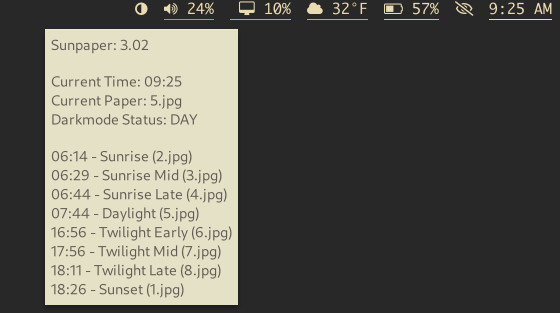
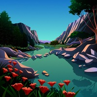

## Sunpaper

Sunpaper is a bash script to change wallpaper based on your local sunrise and sunset times. It seeks to closely replicate the functionality of the Big Sur Dynamic Desktop Wallpapers. This script works really well as a Sway/Waybar or i3/i3blocks module but it should work on any linux distro / window manager.


## Features

- [x] Changes wallpaper based on the sun location where you are
- [x] Sets day/night wallpaper with 3 additional transitions for each sunrise/sunset
- [x] 5 wallpaper themes to choose from ([previews](#wallpaper-previews))
- [x] Darkmode trigger to run external script at day/night
- [x] Waybar mode to display icon and sun time report on tooltip

## TODO

- [ ] New original content FOSS wallpaper themes
- [ ] More custom status bar modes 


## Readme Contents

[Dependencies](#dependencies)  
[Install](#install)  
[Configure](#configure)  
[Test it](#test-it)  
[Set it to run automatically](#set-it-to-run-automatically)  
[Why Sunpaper](#why-sunpaper)  
[Known Issues](#known-issues)  
[Wallpaper Previews](#wallpaper-previews)  


## Dependencies

1. [sunwait](https://github.com/risacher/sunwait)
2. [wallutils](https://github.com/xyproto/wallutils) (for `setwallpaper`)
3. [Font Awesome](https://fontawesome.com) (optionally, for waybar status icon)

Make sure these utilities are already installed. Depending on your distro they may be available within community repositories. If not, these are both pretty easy to build from github source.


## Install

`git clone https://github.com/hexive/sunpaper`

> NOTE: The Wallpaper image files in sunpaper/images are quite large (165MB+ total), so if bandwitdh is a concern you could also just grab the sunpaper.sh script and an individual folder for the theme you want.

1. put sunpaper.sh wherever you want it.
2. make it executable:`chmod +x sunpaper.sh`
3. put the wallpaper folders from sunpaper/images/ wherever you want them.
4. edit sunpaper.sh to set some configuration options ([see below](#configure))
5. test it out `./sunpaper.sh` ([see below](#test-it))
6. automate it from a statusbar or cron or systemd etc ([see below](#set-it-to-run-automatically))


## Configure

Sunpaper takes a few configuration options available by editing the sunpaper.sh file directly:

Set your latitude and longitude for your current location. If you aren't sure you can get these numbers from places like [latlong.net](https://www.latlong.net/) or even google maps.

Make sure your latitude number ends with N  
`latitude="38.9072N"`

and longitude ends with W  
`longitude="77.0369W"`

Set what mode your wallpaper is displayed.  
Options include: stretch | center | tile | scale | zoom | fill  
`wallpaperMode="scale"`

Set the full path to the location of the sunpaper/images:  
`wallpaperPath="$HOME/sunpaper/images/The-Desert"`

Sunpaper writes some cache files to keep track of persistent variables. Set a different location for these or just leave it as the default.
`cachePath="$HOME/.cache"`

You may use the script to trigger a darkmode on your desktop or any other actions you want to preform on day / night. This feature is disabled by default but you can enable it like:  
`darkmode_enable="true"`

If darkmode is enabled, use these two lines to set the the external command to run on day / night.  
`darkmode_run_day=""`  
`darkmode_run_night=""`  

For example:  
`darkmode_run_day="bash /path/to/switch.sh light"`  
`darkmode_run_night="bash /path/to/switch.sh dark"` 

And finally, if you are using --waybar mode you may set the icon display for that here.  
`status_icon=""`


The timing of wallpaper changes is also configurable with human-readable relative time statements, if you can make sense of the bash. By default, most of the day/night is represented with a single wallpaper image, but then there is a flurry of activity within 1.5 hours of both sunrise/sunset.


## Test it

You can test the configuration by just calling the script directly:  
`./sunpaper.sh`

There are a few option flags that can help you during testing:

Help! Show the option flags available.  
`./sunpaper.sh -h`

Report! Show a table of all the time events scheduled for the day.  
`./sunpaper.sh -r`

Clear! Use this to clear the cache files. Call this after any configuration change to force a wallpaper update.  
`./sunpaper.sh -c`

Time! Want to see what will happen later today? This option will set a custom time so you can see what your wallpaper will look like then. It must be in HH:MM format. (-t 06:12)  
`./sunpaper.sh -t HH:MM`

Waybar! Use Waybar? Turn on this option to display an icon in your statusbar and the full sun times report as a tooltip (more details below).  
`./sunpaper.sh --waybar`


## Set it to run automatically

Ideally, the script is called from something with an interval of 60 seconds. That's why statusbars are easy choices, but there are many other options.




**As a waybar module**

Add to waybar/config:

with a status bar icon and sun time report on tooltip as shown above:
```
"custom/sunpaper": {
  "exec": "/path/to/sunpaper.sh --waybar",
  "interval": 60,
  "return-type": "json"
}
```

or to just run quietly with nothing shown on the bar
```
"custom/sunpaper": {
  "exec": "/path/to/sunpaper.sh", 
  "interval": 60,
  "tooltip": false
}
```

Add this line to your startup applications in your main sway config file.    
`exec_always /path/to/sunpaper.sh -c && /path/to/sunpaper.sh`


**As a i3blocks module**

Add to i3blocks.conf
```
[sunpaper]
command=/path/to/sunpaper.sh
interval=60
```

Add this line to your startup applications in your main i3 config file.  
`exec_always /path/to/sunpaper.sh -c && /path/to/sunpaper.sh`


**As a cron job**

[Crontab setup to call a script every minute](https://linuxhint.com/run_cron_job_every_minute/)


**As a systemd service**

(thanks to /u/Dave77459 for sharing his systemd setup)

If you try this you'll obviously need to adjust the paths below for your particular system. 

> Note: setwallpaper uses a lot of environment variables to decide how to best set your paper -- so if things aren't working out of the box, you may need to fine-tune your override.conf for your specific setup.


/etc/systemd/system/sunpaper.timer
```
[Unit]
Description=Run sunpaper script to change wallpaper 

[Timer]
OnCalendar=*:0/1
 
[Install]
WantedBy= sunpaper.service

```

/etc/systemd/system/sunpaper.service
```
[Unit]
Description=sunpaper wallpaper changer

[Service]
User=dave
Group=dave
ExecStart=/home/dave/path/to/sunpaper.sh

[Install]
WantedBy=default.target
```

/etc/systemd/system/sunpaper.service.d/override.conf
```
[Service]
Environment=DISPLAY=:1
Environment=HOME=/home/dave/
```

Relaod systemd daemon:  
`systemctl daemon-reload`

Start it up with:  
`systemctl start sunpaper.timer`

Enable it always with:  
`systemctl enable sunpaper.timer`


## Why Sunpaper?

The Big Sur minimal wallpapers are beautiful and I wanted to use them on my linux machines. There are many other timed wallpaper utilities out there, but they all seemed to be using static timetables for the wallpaper changes. I wanted something that could be directly tied to the sunrise/sunset times locally and adapt to changes over the year without any fiddling on my part.


## Known Issues

- Sway - there's a brief gray flash on each wallpaper change. It's a [known issue](https://github.com/swaywm/sway/issues/3693) with swaywm, apparently, there's not an easy fix.
- Sway - if you use [azote](https://github.com/nwg-piotr/azote) at any time to change your wallpaper, Sunpaper won't be able to make any further changes for that session (logout and log back in to continue).
- Fedora - community repo has older versions of both sunwait and wallutils. Unfortunately, you'll need to build them both from their github sources.


## Wallpaper Previews

Wallpaper images are not mine, they are from the following sources:

**From Apple Big Sur (6016x6016)**

|The Desert|The Lake|The Cliffs|The Beach|
|--|--|--|--|
|||||


**From Louis Coyle: (7680x3214)**  
[https://dribbble.com/louiscoyle](https://dribbble.com/louiscoyle)


|Lakeside|
|--|
||